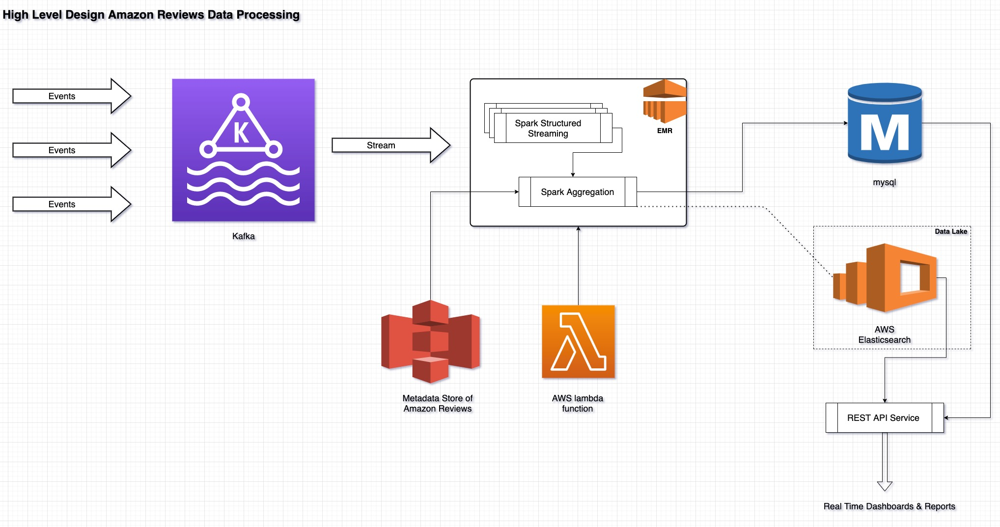

# amazon-review-pipeline
This repository will be used for managing all the code related to pipeline for amazon movies review data.

-----

## High Level Design

-----

# Synopsis

    Data

    Ratings:http://snap.stanford.edu/data/amazon/productGraph/categoryFiles/ratings_Movies_and_TV.csv
    Metadata:http://snap.stanford.edu/data/amazon/productGraph/categoryFiles/meta_Movies_and_TV.json.gz
    Some descriptions on the dataset can be found at http://jmcauley.ucsd.edu/data/amazon/links.html

 

    Assignment

    Create a data pipeline to extract data from the CSV/JSON files, and import it into a database/DFS in order to perform analysis.
    Your solution must:

        download the source data in the pipeline itself.
        have proper error handling/logging.
        show expressive, re-usable, clean code.
        handle duplicates.

    It would be good if your solution could:

        be able to handle the CSV/JSON files as a stream/abstract the file reading into a streaming model.
        use a workflow orchestration tool to schedule the pipeline.
        use docker containers.
        be scalable in case new data were to flow in on a high-volume basis(10x bigger) and has to be imported at a regular basis.
        describe the data store and tools used to query it - including the presentation layer.

    The final result must answer the following questions:

        What are the top 5 and bottom 5 movies in terms of overall average review ratings for a given month?
        For a given month, what are the 5 movies whose average monthly ratings increased the most compared with the previous month?

-----

# Requirements

    JDK 1.7 or higher
    maven
    Scala 2.11.11
    Spark 2.3.3
    Apache kafka 2.11-2.4.1
    elasticsearch 5.X
    mysql
    *AWS Lambda
    *AWS EMR

    * If we want to run the job on AWS EMR Using AWS Lambda.
----

# Build
    
    *** Change your /config/pipeline_config.json entries 
    according to your configuration ***

    Go to project root dir
    > mvn clean install -U

------

# Run

    Can use /script/lambda/amazon_review_lambda.py to configure a lambda function on AWS lambda
    by changing your VPC & security grougp configuration.

    Or For dry run execute ReviewDataController.scala first and then CsvProducer.scala as scala application from intellij

------
